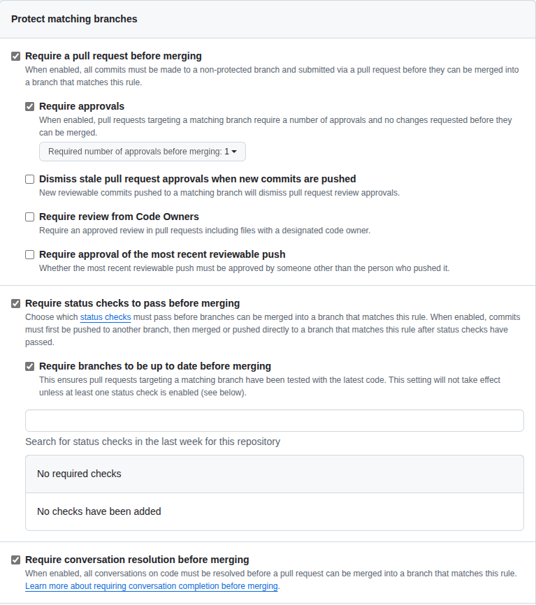
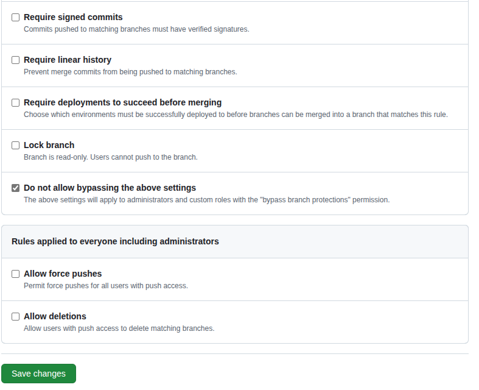

# GitHub Organization Structure

## Repository Layout

- **Single Repository**: `demos` (monorepo approach)
- **Branch Strategy**:
  - `main`: Stable demos
  - `develop`: Work in progress
  - `feature/demo-name`: Individual demo development

## GitHub Features to Leverage

- **GitHub Codespaces**: For containerized demos
- **GitHub Actions**: CI/CD for demos
- **GitHub Pages**: Documentation hosting
- **GitHub Discussions**: Community interaction
- **Releases**: Versioned demo collections

## Organization Considerations

1. **Team Access**: Use GitHub teams for different demo categories
2. **Branch Protection**: Protect main branch
3. **PR Templates**: Standardize demo submission
4. **Issue Templates**: Bug reports and feature requests
5. **Projects**: Track demo development status

## Container Integration

- Devcontainers work seamlessly with GitHub Codespaces
- Git changes visible inside containers
- Docker volumes mounted correctly
- GitHub CLI available in containers

## GitHub Actions Setup

### Branch Protection Rules

- Require pull request reviews before merging
  - At least one approval
- Require status checks to pass before merging
  - Require branches to be up to date before merging
- Require conversation resolution before merging
- Do not allow bypassing the above settings

