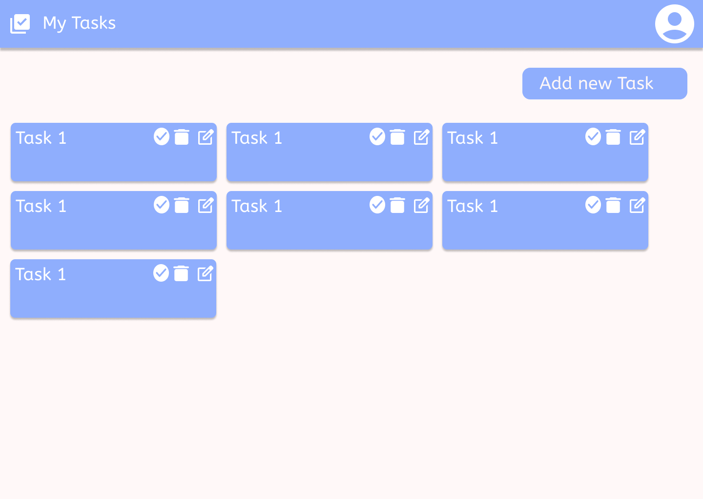
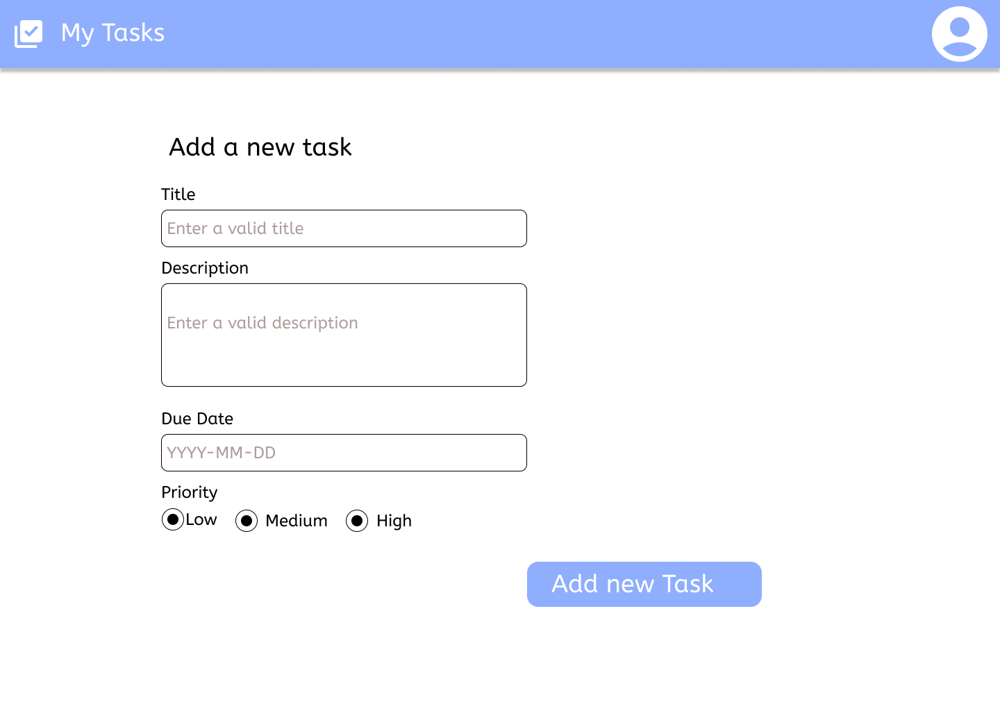
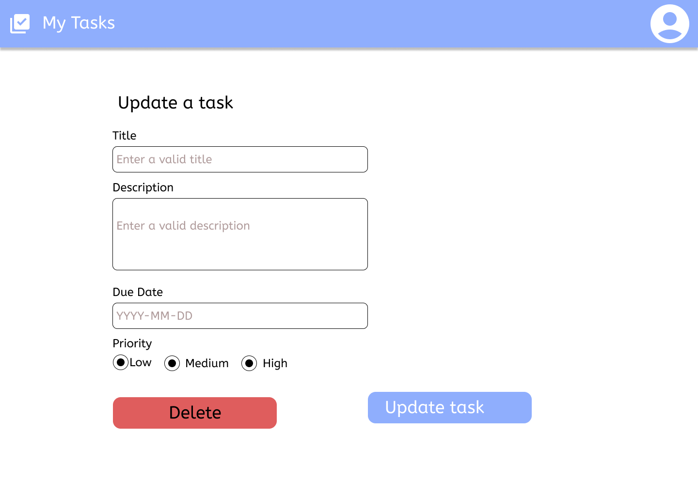

# Todos

## Core Features
- CRUD operations for todo items:
  - Title (required)
  - Description (optional)
  - Due date (required)
  - Priority (Low, Medium, High)
  - Status (Pending, In Progress, Completed)
  - Created date (auto-generated)
  - Last modified date (auto-generated)

- Organization and Discovery:
  - Filter todos by:
    - Status
    - Priority
    - Due date range
    - Categories/Tags
  - Sort todos by:
    - Creation date
    - Due date
    - Priority
    - Status
  - Search functionality:
    - Full-text search across title and description
    - Filter by tags
  - Categories and tags support

- User Interface:
  - Responsive design:
    - Mobile-first approach
    - Tablet optimization
    - Desktop layout
  - User feedback:
    - Success/error notifications
    - Loading states
    - Confirmation dialogs for destructive actions
  - Offline capabilities:
    - Offline data access
    - Background sync when online

## Data Storage Solutions
### Client-side Storage
- Local Storage Implementation:
  - Data size monitoring and cleanup utilities
  - Browser compatibility handling
  - Storage limits handling
  - Cache management
  - Data compression
  - Automatic data cleanup for old/completed todos
  - Export/Import functionality

### Server-side Storage
#### MongoDB Implementation
- Schema Design:
  - Todo collection with proper indexing
  - User collection for multi-user support
  - Tags/Categories collection
- Features:
  - Aggregation pipelines for advanced queries
  - Full-text search capabilities
  - Change streams for real-time updates
  - Data versioning and soft deletes
  - Automatic data archival
  - Caching layer with Redis (optional)

#### RDBMS Implementation (PostgreSQL/MySQL)
- Database Schema:
  - Todos table with proper constraints
  - Users table for authentication
  - Tags/Categories tables
  - Join tables for many-to-many relationships
- Features:
  - Transactions for data integrity
  - Foreign key constraints
  - Full-text search integration
  - Proper indexing strategy
  - Data partitioning for large datasets
  - Audit logging

### Storage Strategy
- Hybrid Approach:
  - Local storage for offline capability
  - Server synchronization when online
  - Conflict resolution strategy
  - Data versioning
- Data Migration:
  - Tools for moving between storage solutions
  - Version migration scripts
  - Data validation and integrity checks
- Backup and Recovery:
  - Automated backups
  - Point-in-time recovery
  - Data retention policies

## Bonus Features
- Theme Support:
  - Dark/light theme toggle
  - System theme detection
  - Custom color schemes

- Productivity Features:
  - Keyboard shortcuts:
    - Add new todo (Ctrl/Cmd + N)
    - Save todo (Ctrl/Cmd + S)
    - Delete todo (Ctrl/Cmd + D)
    - Search (Ctrl/Cmd + F)
  - Bulk actions:
    - Multi-select todos
    - Batch status updates
    - Batch delete

- Data Management:
  - Export functionality:
    - JSON format
    - CSV format
    - Selective export (filtered data)
  - Import functionality:
    - File validation
    - Duplicate detection
    - Merge or replace options
  - Auto-save
  - Undo/redo support

## Technical Requirements
- TypeScript-based implementation
- Unit test coverage
- Accessibility compliance (WCAG 2.1)
- Performance optimization:
  - Lazy loading
  - Virtual scrolling for large lists
  - Debounced search
- API Layer:
  - RESTful endpoints
  - GraphQL interface (optional)
  - API versioning
  - Rate limiting
  - Authentication/Authorization
- Database:
  - Connection pooling
  - Query optimization
  - Error handling and retries
  - Migration management

## UI Mockups

### Home Screen

### Add Task Screen

### Update Task Screen

